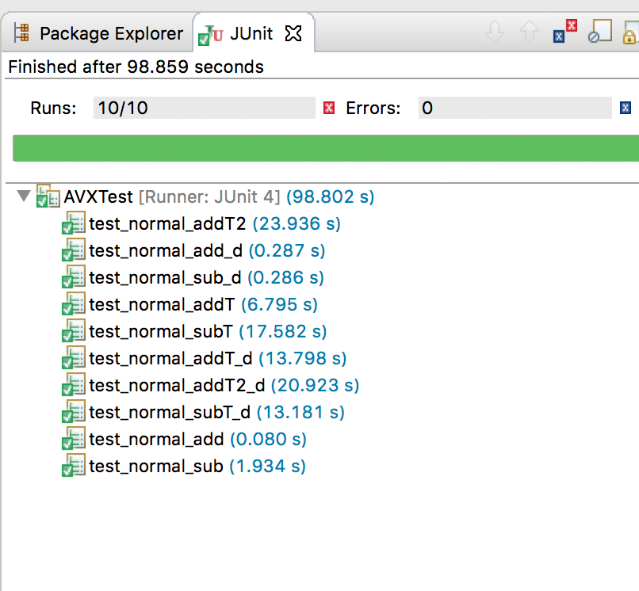

# Comparing java and C++

## History : C++ pave the way for Java

Is it really worth reigniting the fight between the aficionados of java and C++?
Having been in IT for long enough and having started programming as a kid at the time where it was either basic or assembler (peek and poke :sweat_smile:), I must say that we really need to understand why language have been invented and what gap there were supposed to fill and what value there were supposed to deliver.

C++ was really to my mind a revolution, because it brings object programming to "masses" (even though C++ is a true all around language), however it was still seen and been a language of elite. The masses of IT in the 80s were looking at computer as a curiosity and not yet with the aesthetic that came later in gaming, phone etc ... I remember the time of smaltalk or lisp, I am still a great fan of lisp, for people that do not know, functional programming was invented a long time ago : lisp was formed already in 1958 my john McCarthy!

Coming back to C++, as it becomes clear that the new object oriented paradigm was taking over the old time procedural paradigm such as PL1, Pascal and others, many developer were migrating to C++ with various level of successes.

## Here comes Java

Java is C++ for masses. In other words, it was too much to expect developers to learn the one concept that really makes Java Developers really scared when it comes to talk about C++ : THE HORRIBLE POINTER an the memory management. Since that time people have try to argue about java being faster and overtaking C++, this is just denying the fact that a good java developer facing a good C++ developer can only reach par with always an edge for c++ developer. However this is true that most smart developers especially the millennials have learnt that only java exist :stuck_out_tongue_winking_eye:

## Observation #1 : difficult to match C++ performance 

I will stop the discussion here and show that in the old days people use to look at efficiency from different sides, in the world of java usually scalability at cost seems to satisfy most. Here is an example showing the same program in C++ and java, just look at resources, number of threads to not even reach the speed of C++.


the picture here under shows at the top how much of C++ program takes versus the java equivalent underneath. 

- where C++ takes only one thread, Java may need many more (30 here).
- when C++ consume CPU (45"), java consumes 2 times more (1'28")
- Finally the runtime of C++ is not challenge at all by java : 13 vs. 22 on float and 28 vs. 32 on double.


### here are some Junit Results 




### Java output

```java
!!!Hello World OF Advanced Vector Extensions for : iteration : 51200000 

test_normal_addT2 => Java/Inline Float      Results Iteration # 51200000 duration 10532 millis result

test_normal_add_d => Java/Inline Double      Results Iteration # 51200000 duration 32 millis result

test_normal_sub_d => Java/Inline Double      Results Iteration # 51200000 duration 34 millis result

test_normal_addT => Java/Inline Float      Results Iteration # 51200000 duration 3652 millis result

test_normal_subT => Java/Inline Float      Results Iteration # 51200000 duration 2665 millis result

test_normal_addT_d => Java/Inline Double      Results Iteration # 51200000 duration 3153 millis result

test_normal_addT2_d => Java/Inline Double      Results Iteration # 51200000 duration 14397 millis result

test_normal_subT_d => Java/Inline Double      Results Iteration # 51200000 duration 3213 millis result

test_normal_add => Java/Inline Float      Results Iteration # 51200000 duration 22 millis result

test_normal_sub => Java/Inline Float      Results Iteration 
```

### Some high level profiling information


### Observation #2 : Java may be scalable but what a cost!

in a world of plenty, java does not encourage developer to write efficient code even though lot of good developer write efficient java code. 

### Observation #3 : C++ template have no match to reach abstraction than java generics

Java has copied C++, Java has simplified C++ all great.
However java has template implementation not practical to use. Runtime generated with generic is taking way too much time to run and level of abstraction does not reach the purpose of their equivalent in C++. I doubt good java developer using them intensively.

where in c++ a template for any type like `int`,`long`,`float` or `double` can be written like 

```cpp
template<typename T>
void normal_add(T* a, int N) {
	for (int i = 0; i < N / 2; ++i)
		a[i] = a[i] + a[N / 2 + i];
}
```
in java we need first to inherit from Number which will cost a huge runtime, second we need to check the data type which remove the beauty of the abstraction in C++

```java
static <T extends Number> void normal_addT(T a[], int N) {
		if (a[0] instanceof Float)
			for (int i = 0; i < N / 2; ++i)
				a[i] = (T) (Number) (a[i].floatValue() + a[N / 2 + i].floatValue());
		else if (a[0] instanceof Double)
			for (int i = 0; i < N / 2; ++i)
				a[i] = (T) (Number) (a[i].doubleValue() + a[N / 2 + i].doubleValue());

	}
```


