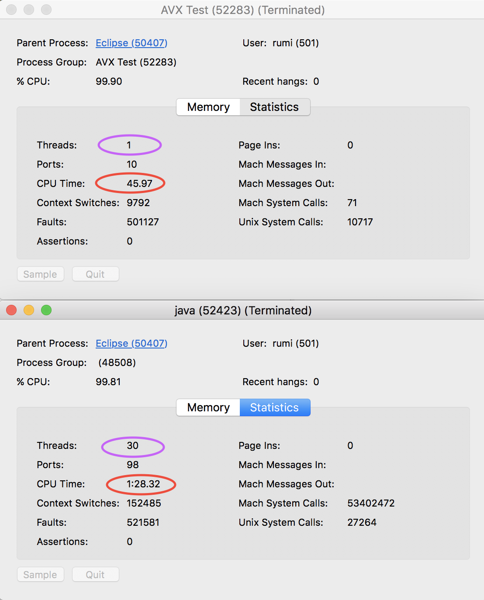
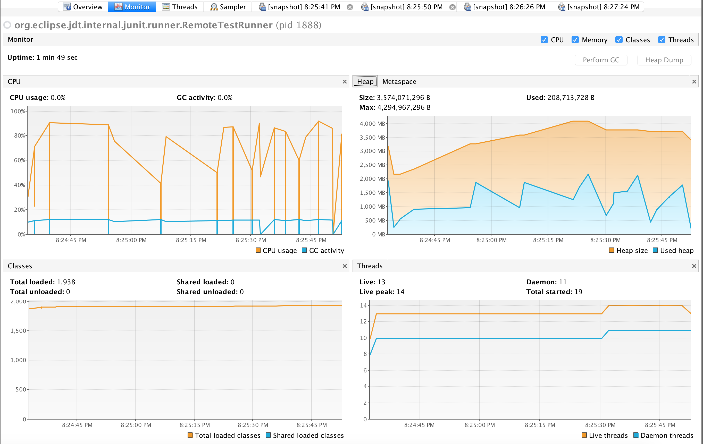

# Comparing java and C++

Is it really worth reigniting the fight between the aficionados of java and C++?
Having been in IT for long enough and having started programming as a kid at the time where it was either basic or assembler (peek and poke :sweat_smile:), I must say that we really need to understand why language have been invented and what gap there were supposed to fill and what value there were supposed to deliver.

C++ was really to my mind a revolution, because it brings object programming to "masses" (even though C++ is a true all around language), however it was still seen and been a language of elite. The masses of IT in the 80s were looking at computer as a curiosity and not yet with the aesthetic that came later in gaming, phone etc ... I remember the time of smaltalk or lisp, I am still a great fan of lisp, for people that do not know, functional programming was invented a long time ago : lisp was formed already in 1958 my john McCarthy!

Coming back to C++, as it becomes clear that the new object oriented paradigm was taking over the old time procedural paradigm such as PL1, Pascal and others, many developer were migrating to C++ with various level of successes.

