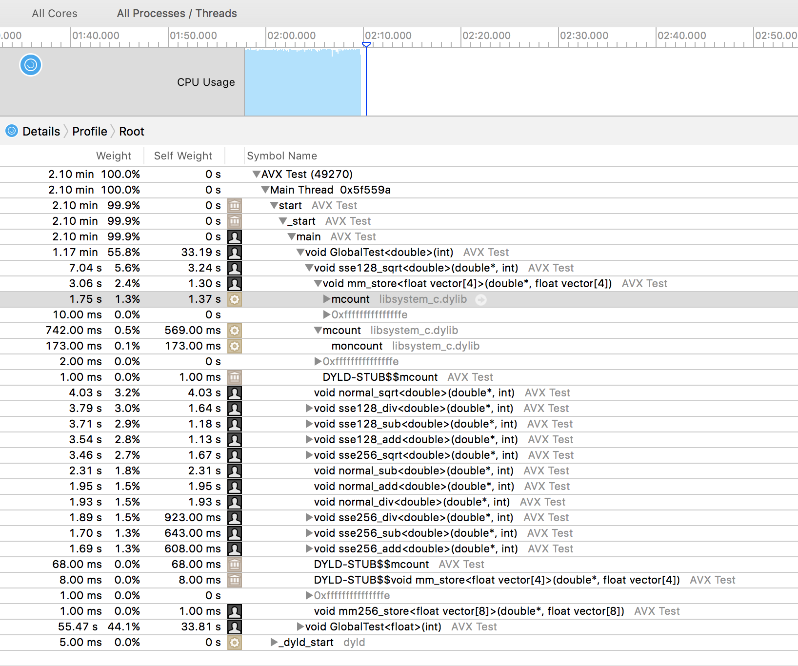

# Crunching Numbers with Advanced Vector Extensions 

## Introduction

Much before GPU existed, processor designer always try to come with specific respond to need for performance depending on context. GPU has been overshadowing what industry knew for very long, the "darwin" therory of evolution has worked well to my mind in the chip space too. Just few things to remember :

- RISC architecture is to me one evolution that may have inspired GPU.
- DSP architecture was a super narrow specialized chip for digital signal processing and to attempt to parallelise more instruction in the same machine cycle. One of the evolution of DSP is SIMD (Single instruction, multiple data) then Advanced Vector Extensions.

Wikipedia is doing a good job educating us on something not new but that new generation may think that the revolution has just happened in the post internet time!

>[:eyes:RISC architecture](https://en.wikipedia.org/wiki/Reduced_instruction_set_computer)

>[:eyes:DSP Architecture](https://en.wikipedia.org/wiki/Digital_signal_processor)

>[:eyes:AVX](https://en.wikipedia.org/wiki/Advanced_Vector_Extensions)

More information on how to use all the AVX features can be found at :

>[:eyes:CompilerAutovectorizationGuide source link](https://software.intel.com/sites/default/files/m/4/8/8/2/a/31848-CompilerAutovectorizationGuide.pdf)

>[:eyes:CompilerAutovectorizationGuide copy link](31848-CompilerAutovectorizationGuide.pdf)


## using AVX

Most modern c++ compiler can automatically vectorize loops. In the example here under you will see how you can use intrinsic code to control vectorization at the code machine level. However the compiler has implemented very smart combination of optimization that does not just limit to one straight pattern but combining several techniques and features.

### Use case #1 


 
### Results single Precision

### Compiler options : NO optimization

```
**** Incremental Build of configuration Debug for project AVX Test ****
make all 
Building file: ../src/AVX Test Single Precision.cpp
Invoking: Cross G++ Compiler
g++ -std=c++0x -mxsave -mavx -O0 -g3 -Wall -c -fmessage-length=0 -MMD -MP -MF"src/AVX Test Single Precision.d" -MT"src/AVX\ Test\ Single\ Precision.d" -o "src/AVX Test Single Precision.o" "../src/AVX Test Single Precision.cpp"
Finished building: ../src/AVX Test Single Precision.cpp
 
Building target: AVX Test
Invoking: Cross G++ Linker
g++  -o "AVX Test"  ./src/AVX\ Test\ Single\ Precision.o   
Finished building target: AVX Test
```
#### Results

```
!!!Hello World OF Advanced Vector Extensions for : f sizeof  : 4
Effective Threads Runtime
********* SQRT TEST ************
normal_sqrt	 1.18230 s
sse128_sqrt	 0.76245 s
sse256_sqrt	 0.40706 s
********* ADD  TEST ************
normal_add	 1.56866 s
sse128_add	 0.39155 s
sse256_add	 0.20484 s
********* SUB  TEST ************
normal_sub	 1.35702 s
sse128_sub	 0.49698 s
sse256_sub	 0.29242 s
********* DIV  TEST ************
normal_div	 1.79099 s
sse128_div	 0.44068 s
sse256_div	 0.24973 s

Effective clock Runtime

Memory 0.     23 s
Init   2.2707667 s
********* SQRT TEST ************
normal 1.1185392 s
sse128 0. 763030 s
sse256 0. 407841 s
********* ADD  TEST ************
normal 1.1571739 s
sse128 0. 391574 s
sse256 0. 204908 s
********* SUB  TEST ************
normal 1.1357153 s
sse128 0. 499326 s
sse256 0. 293546 s
********* DIV  TEST ************
normal 1.1807887 s
sse128 0. 442165 s
sse256 0. 251021 s


!!!Hello World OF Advanced Vector Extensions for : d sizeof  : 8
Effective Threads Runtime
********* SQRT TEST ************
normal_sqrt	 2.45592 s
sse128_sqrt	 1.69520 s
sse256_sqrt	 0.88048 s
********* ADD  TEST ************
normal_add	 1.92358 s
sse128_add	 1.03729 s
sse256_add	 0.55327 s
********* SUB  TEST ************
normal_sub	 1.87122 s
sse128_sub	 1.04833 s
sse256_sub	 0.57651 s
********* DIV  TEST ************
normal_div	 1.90913 s
sse128_div	 1.12137 s
sse256_div	 0.52255 s

Effective clock Runtime

Memory 0.     21 s
Init   4.4712237 s
********* SQRT TEST ************
normal 2.2469487 s
sse128 1.1697042 s
sse256 0. 881229 s
********* ADD  TEST ************
normal 1.1937319 s
sse128 1.1041524 s
sse256 0. 559515 s
********* SUB  TEST ************
normal 1.1873779 s
sse128 1.1053096 s
sse256 0. 579335 s
********* DIV  TEST ************
normal 1.1916469 s
sse128 1.1140102 s
sse256 0. 524420 s

```


```assembly
+0xa0	    jne                 "void normal_add<float>(float*, int)+0xab"
+0xa6	    jmp                 "void normal_add<float>(float*, int)+0x119"
+0xab	    movl                $2, %eax
+0xb0	    movq                10553(%rip), %rcx
+0xb7	    addq                $1, %rcx
+0xbb	    movq                %rcx, 10542(%rip)
+0xc2	    movslq              -16(%rbp), %rcx
+0xc6	    movq                -8(%rbp), %rdx
+0xca	    vmovss              (%rdx,%rcx,4), %xmm0
+0xcf	    movl                -12(%rbp), %esi
+0xd2	    movl                %eax, -52(%rbp)
+0xd5	    movl                %esi, %eax
+0xd7	    cltd
+0xd8	    movl                -52(%rbp), %esi
+0xdb	    idivl               %esi
+0xdd	    addl                -16(%rbp), %eax
+0xe0	    movslq              %eax, %rcx
+0xe3	    movq                -8(%rbp), %rdi
+0xe7	    vaddss              (%rdi,%rcx,4), %xmm0, %xmm0
+0xec	    movslq              -16(%rbp), %rcx
+0xf0	    movq                -8(%rbp), %rdi
+0xf4	    vmovss              %xmm0, (%rdi,%rcx,4)
+0xf9	    movq                10488(%rip), %rax
+0x100	    addq                $1, %rax
+0x104	    movq                %rax, 10477(%rip)
+0x10b	    movl                -16(%rbp), %ecx
+0x10e	    addl                $1, %ecx
+0x111	    movl                %ecx, -16(%rbp)
+0x114	    jmp                 "void normal_add<float>(float*, int)+0x4d"

```


### Compiler options : all optimization

```
**** Incremental Build of configuration Debug for project AVX Test ****
make all 
Building file: ../src/AVX Test Single Precision.cpp
Invoking: Cross G++ Compiler
g++ -std=c++0x -mxsave -mavx -O3 -g3 -Wall -c -fmessage-length=0 -MMD -MP -MF"src/AVX Test Single Precision.d" -MT"src/AVX\ Test\ Single\ Precision.d" -o "src/AVX Test Single Precision.o" "../src/AVX Test Single Precision.cpp"
Finished building: ../src/AVX Test Single Precision.cpp
 
Building target: AVX Test
Invoking: Cross G++ Linker
g++  -o "AVX Test"  ./src/AVX\ Test\ Single\ Precision.o   
Finished building target: AVX Test
```
#### Resutls
```
!!!Hello World OF Advanced Vector Extensions for : f sizeof  : 4
Effective Threads Runtime
********* SQRT TEST ************
normal_sqrt	 0.48298 s
sse128_sqrt	 0.17059 s
sse256_sqrt	 0.15783 s
********* ADD  TEST ************
normal_add	 0.12038 s
sse128_add	 0.13360 s
sse256_add	 0.12077 s
********* SUB  TEST ************
normal_sub	 0.12020 s
sse128_sub	 0.12829 s
sse256_sub	 0.12408 s
********* DIV  TEST ************
normal_div	 0.12853 s
sse128_div	 0.13228 s
sse256_div	 0.13614 s

Effective clock Runtime

Memory 0.     25 s
Init   1.1123633 s
********* SQRT TEST ************
normal 0. 483011 s
sse128 0. 170588 s
sse256 0. 157825 s
********* ADD  TEST ************
normal 0. 120392 s
sse128 0. 133654 s
sse256 0. 120796 s
********* SUB  TEST ************
normal 0. 120199 s
sse128 0. 128295 s
sse256 0. 124076 s
********* DIV  TEST ************
normal 0. 128529 s
sse128 0. 132324 s
sse256 0. 136171 s


!!!Hello World OF Advanced Vector Extensions for : d sizeof  : 8
Effective Threads Runtime
********* SQRT TEST ************
normal_sqrt	 2.09169 s
sse128_sqrt	 0.60109 s
sse256_sqrt	 0.56982 s
********* ADD  TEST ************
normal_add	 0.27129 s
sse128_add	 0.26449 s
sse256_add	 0.26158 s
********* SUB  TEST ************
normal_sub	 0.26944 s
sse128_sub	 0.26666 s
sse256_sub	 0.29683 s
********* DIV  TEST ************
normal_div	 0.26417 s
sse128_div	 0.34963 s
sse256_div	 0.26218 s

Effective clock Runtime

Memory 0.     24 s
Init   2.2699656 s
********* SQRT TEST ************
normal 2.2136843 s
sse128 0. 602878 s
sse256 0. 570262 s
********* ADD  TEST ************
normal 0. 271612 s
sse128 0. 264537 s
sse256 0. 261813 s
********* SUB  TEST ************
normal 0. 269849 s
sse128 0. 266866 s
sse256 0. 297276 s
********* DIV  TEST ************
normal 0. 264256 s
sse128 0. 350930 s
sse256 0. 262520 s

```

here under few screen shot on the code profiling that demonstrate the assembler code of the standard mormal_add function using AVX features after compiler optimized

the code has been so much optimized that everything has been in-lined, anyway after some invesigation it is not too complicated to figure out, here it is. 

```assembly
+0xed	callq               "DYLD-STUB$$std::__1::chrono::steady_clock::now()"
+0xf2	callq               "DYLD-STUB$$clock"
+0xf7	movq                -32(%rbp), %rbx
+0xfb	leaq                10334(%rip), %r15
+0x102	vmovdqa             10326(%rip), %xmm0
+0x10a	vpaddq              8478(%rip), %xmm0, %xmm0
+0x112	vmovdqa             %xmm0, 10310(%rip)
+0x11a	callq               "DYLD-STUB$$mcount"
+0x11f	xorl                %eax, %eax
+0x121	cmpl                $2, %r14d
+0x125	setl                %al
+0x128	incq                16(%r15,%rax,8)
+0x12d	cmpl                $2, %r14d
+0x131	jl                  "main+0x16b"
+0x133	shrl                %r14d
+0x136	leaq                (%rbx,%r14,4), %rax
+0x13a	xorl                %ecx, %ecx
+0x13c	nopl                (%rax)
+0x140	    incq                10305(%rip)
+0x147	    vmovss              (%rbx,%rcx,4), %xmm0
+0x14c	    vaddss              (%rax,%rcx,4), %xmm0, %xmm0
+0x151	    vmovss              %xmm0, (%rbx,%rcx,4)
+0x156	    incq                %rcx
+0x159	    xorl                %edx, %edx
+0x15b	    cmpq                %r14, %rcx
+0x15e	    setge               %dl
+0x161	    incq                16(%r15,%rdx,8)
+0x166	    cmpq                %r14, %rcx
+0x169	    jl                  "main+0x140"
+0x16b	incq                10254(%rip)
+0x172	callq               "DYLD-STUB$$std::__1::chrono::steady_clock::now()"
+0x177	callq               "DYLD-STUB$$clock"
```
## Modern compiler are integrating vectorization in standard optimization configuration


Interesting to notice that we are a bit lost here because the optimizer has even optimized sse128, it is clever enough to have use sse256 to optimize sse128:heart_eyes: 


## Profiling Tools
Rather than including marker in the code in a form of logging information, a better approach is to use profiling tools like valgrind on linux or Instruments on osx.




### Rerpot if the optimizer succeeded in vetorized

```
-Rpass=loop-vectorize identifies loops that were successfully vectorized.

-Rpass-missed=loop-vectorize identifies loops that failed vectorization and indicates if vectorization was specified.

-Rpass-analysis=loop-vectorize identifies the statements that caused vectorization to fail.
```

it shows interactively in eclipse in front of each loop whether it has been or not optimized

at compile time it will indicate as well something like 

```
../src/AVX Test Single Precision.cpp:85:2: remark: vectorized loop (vectorization width: 4, interleaved count: 4) [-Rpass=loop-vectorize]
        for (int i = 0; i < N / 2; ++i)
../src/AVX Test Single Precision.cpp:191:2: remark: loop not vectorized [-Rpass-missed=loop-vectorize]
        for (int i = 0; i < nb_iters; ++i, ++ptr, ++ptr2, a += 32 
```

